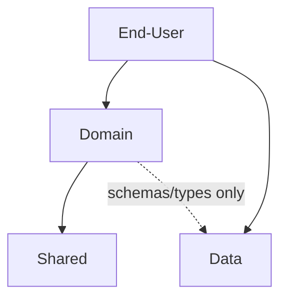

# Frontend Layered Architecture

## Overview

Frontend directory structures should not collapse into “pages and everything else.” Type-revealing but role-ambiguous folders such as `components`, `hooks`, `models`, `utils`, and `shared` can absorb all code. This skill does not exist to force a large architecture. It exists to prevent business rules, API calls, URL state, and similar logic from unconsciously leaking into inappropriate folders during implementation.

Code should be separated into layers by role, dependency, external data boundary, and orchestration responsibility. Lower-level code must not be made aware of higher-level context.

This skill does not enforce a specific methodology such as Feature-Sliced Design, Vertical Slice Architecture. Type-based, feature-based, domain-driven, and other directory structures can all be valid. What matters is whether roles and dependency direction are clear within the structure the project has chosen, whether external data contracts are isolated, and whether code responsibilities and frontend-owned domain logic are managed effectively.

## Common Foundation

If the project already uses layer terminology, prefer the project’s terms. Use the terms below only when there is no existing terminology, or when explaining structure. These abstract layer names are not default directory names; do not convert End-User, Domain, Shared, or Data into folders unless the user explicitly selected those names.

| Layer | Meaning |
| --- | --- |
| End-User | Screens delivered to users. The highest-level layer, such as pages and routes, where UI flow, data fetching, and orchestration are handled. |
| Domain | Reusable business rules, validation, calculations, and feature flags, similar to Clean Architecture Entities and Use Cases. It excludes API calls and external service access. |
| Shared | Pure code that knows no external context. This is the lowest-level layer. |
| Data | External data contracts and execution boundaries. API-related source code belongs here and is treated like frontend-consumed externally-owned code, even when frontend developers wrote it. |

These abstract layers are the minimum units for designing a sound frontend structure. Real projects may split them further, but this means at least four concepts are needed. That is why they are abstract layers.

Minimum guards:

- Layer names are abstract concepts, not required folder names.
- Shared is determined by code-level independence, not by generic names or absence of domain words. For example, `ProductCard` can be Shared if it only renders injected props, while a generic-looking `buildSearchParams` is not Shared if it knows router state, API request parameters, store state, or business rules.
- Data means a boundary the frontend consumes like externally-owned code; it does not mean the file must be physically external or written by another team. For example, OpenAPI-generated client/schema code and manually written API endpoint/schema code are both Data when the frontend consumes them as external contracts.
- Even within the same abstract layer, dependency validity depends on role and responsibility. For example, if a project maps both `features` and `widgets` to Domain, `features` may still be forbidden from importing UI orchestration in `widgets`.

## Purpose Router

Before acting, classify the user’s purpose in one sentence, then read the first matching document. Do not use this file as a substitute for the routed document.

| User purpose | Read |
| --- | --- |
| Existing project structure judgment, file placement, file extraction, import direction, or dependency boundary decision | [`brownfield.md`](./brownfield.md) |
| New frontend project with no chosen directory/layer structure | [`greenfield.md`](./greenfield.md) |
| Architecture documentation such as `docs/architecture.md`, directory rules, dependency rules, or Mermaid overview | [`writing-docs.md`](./writing-docs.md) |
| ESLint, CI, import boundaries, or other tool-based enforcement of architecture rules | [`enforcing-rules.md`](./enforcing-rules.md) |
| Boundary is still ambiguous after the main routed document, or examples are needed to avoid role confusion | [`best-practices.md`](./best-practices.md) |

Routing rules:

- Choose the document by the user’s actual purpose, not by the first architecture keyword you notice.
- If a request has multiple purposes, route to the purpose that controls the next user-visible action. Example: “configure ESLint from architecture rules” routes to `enforcing-rules.md`, not directly to general structure judgment.
- After reading the routed document, check whether it directly answers the user’s purpose. If not, say what is missing and route to the next required source instead of pretending the skill contains the answer.
- In existing codebases, do not read `greenfield.md` unless the user explicitly asks for a new structure flow.
- Do not read `best-practices.md` as a default step. Use it only as a boundary reference after the main route leaves a judgment uncertain.
