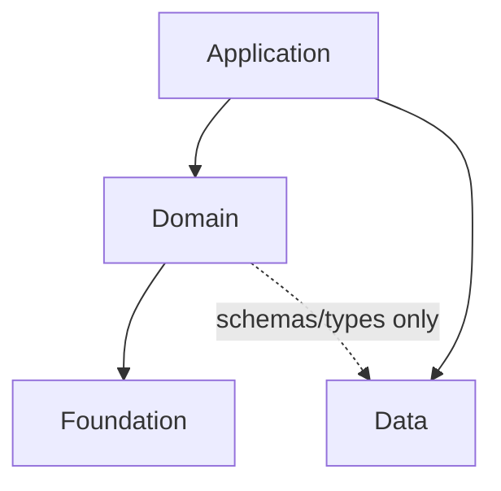

# Frontend Layered Architecture

## Overview

Frontend directory structures should not be split into only “pages and everything else.” “Everything else” means a state where type-revealing but role-ambiguous folders such as `components`, `hooks`, `models`, `utils`, and `shared` absorb all code. This skill does not exist to force a large architecture. It exists to prevent product policy, API calls, URL state, and similar logic from unconsciously leaking into inappropriate folders during implementation. The core principle is to observe the actual structure of the current project, classify the role of each folder and file, and preserve the dependency direction appropriate to that role. Do not simply memorize folder names.

Code should be separated into layers by role, dependency, external data boundary, and orchestration responsibility. Lower-level code must not be made aware of higher-level context. Experienced frontend developers can practice clean code even in a “pages and everything else” structure, but in large teams, large projects, and coding-agent workflows, you cannot assume those principles will hold automatically.

This skill does not enforce a specific methodology such as Feature-Sliced Design or Vertical Slice Architecture. Type-based, feature-based, domain-driven, and other directory structures can all be valid. What matters is whether roles and dependency direction are clear within the structure the project has chosen, whether external data contracts are isolated, and whether code responsibilities and frontend-owned domain logic are managed effectively.

## When to Use

Use this skill when:

- Implementing or modifying frontend features
- Creating a new file or moving an existing file
- Extracting existing code into a new file
- Deciding where an implementation or piece of logic should live
- Adding imports or judging dependency direction
- Designing the structure of a new frontend project

You do not need to use it when:

- You are only changing a small piece of copy or styling inside an already-correct file, and file placement, extraction, import paths, and dependencies do not change

## Abstract Layers

If the project already uses layer terminology, prefer the project’s terminology. Use the following terms only when there is no existing layer terminology, or when the structure needs to be explained.



| Layer | Meaning |
| --- | --- |
| Application | Screens delivered to users. The highest-level layer, such as pages and routes, where UI flow, data fetching, and orchestration are handled. |
| Domain | Reusable business rules, similar to Clean Architecture Entities and Use Cases. It covers product policy, validation, calculations, and feature flags, while excluding API calls and external service access. |
| Foundation | Pure code that knows no external context. This is the lowest-level layer. |
| Data | External data contracts. API-related code belongs here, and unlike the other three layers, it is treated as external code. |

These abstract layers are the minimum units for designing a sound frontend structure. Real projects may split them further, but this means at least four concepts are needed. These are abstract layers, so they do not force actual project folder names.

### Abstract Layers and Dependencies

The dependency direction between abstract layers flows Application → Domain → Foundation. However, whether a dependency is valid depends not only on the abstract layer, but also on responsibility and role. For example, in some projects both `features` and `widgets` may be Domain-layer folders. But if `features` contains only entities and use cases and `widgets` contains UI components, then it may be the wrong dependency for `features` to depend on `widgets`.

### Misunderstanding the Foundation Layer

Foundation is not determined by “no domain words.” It is determined by code-level independence. Even when code expresses concepts used by the product and its target market, it can be considered Foundation if it does not directly depend on APIs, queries, stores, routers, form state, and instead receives required values by injection. Conversely, even if a name sounds generic, it is not Foundation if it directly knows external data or domain policy.

### Data Layer Exceptions

The Data layer is generally not a frontend responsibility. Whether the code was generated from an OpenAPI spec, written manually, or decided together with the backend team, the frontend consumes it at the code level. Therefore, API clients and schemas are treated as external contract code that should not be mixed with frontend-owned code, even when frontend developers wrote them directly.

The Data layer also has different dependency direction. The default direction for abstract layers is Application → Domain → Foundation, but Data-layer dependencies depend on project and team design rules. For example, if a project allows Foundation-layer components to express domain context through UI design, API calls may still be forbidden while API schema references are allowed. As another example, analytics and error collection may be treated as cross-cutting concerns and inserted directly into the Foundation layer. These are examples only. Do not implicitly allow them; first check project rules and existing structure.

## Decision Procedure

### When to Stop

Immediately before any of the following frontend changes, stop and check roles and boundaries. Do not skip this just because the user did not ask about structure or because the change looks small.

- Planning implementation, reviewing code, or evaluating the user’s suggestion/instruction
- Writing new code
- Creating, moving, or renaming files
- Extracting part of an existing file
- Adding a new import or changing an import path

This checkpoint does not mean you must always explain structure at length to the user. If there is no problem, apply it silently and continue. Only when a boundary may be broken should you briefly state the reason and the safe alternative.

### What to Check

After stopping, check the following:

1. Are there explicit rules in `AGENTS.md`, `CLAUDE.md`, `README.md`, architecture docs, the current directory structure, or lint rules?
2. Which layer is this code closest to? (Application, Domain, Foundation, Data)
3. What role does this code have? (API, UI, Policy, Utility, etc.)
4. Even within the same abstract layer, are there role-based dependency directions that should be disallowed?
5. If this code is placed in a lower-level role folder, will that folder learn higher-level context?
6. Are external data contracts and frontend-owned policy mixed in the same file or code?
7. Is this code being placed in `components`, `hooks`, `models`, `utils`, `shared`, or a similar location only because it is reusable?
8. If rules already exist, what placement respects those rules while avoiding worse dependency direction within the current scope?

In existing projects, do not force a large structural change. Improve only around the code you touch, and if you notice a larger structural problem, mention it only briefly and lightly.

## Role Classification and Placement Criteria

Folder names are conventions or rules, not actual roles. Do not judge layers by folder names alone. First inspect project rules and actual usage, then infer the layer and role from observed responsibility.

The following are examples. Each layer may contain more responsibilities or roles.

| Observed responsibility example | Role | Layer |
| --- | --- | --- |
| Page UI, route configuration, URL state subscription, navigation control | Screen-level UI orchestration | Application |
| Independently functioning feature UI, such as `<NewArrivalsSection shopId={shopId} />` or `<AuthorizationDialog onComplete={onComplete} />` | Standalone feature UI orchestration | Application |
| Product policy, validation, calculations, and feature flags, such as `canBuyProduct(product)` or `isBetaEnabled(user)` | Reusable business rules, similar to Clean Architecture Entities and Use Cases (without API calls and external service access) | Domain |
| Components that render UI only from props but directly express business requirements in code | Domain-aware UI presentation | Domain |
| Components that render UI only from props and do not directly read external data | Generic UI presentation | Foundation |
| Utility functions/modules, browser API wrappers | Generic utility logic | Foundation |
| API endpoint calls, API schemas, Query/Mutation Options | External data contracts and execution | Data |

## Default Choices When Ambiguous

- Keep code next to its caller. If there are multiple callers, place it in the layer of the nearest caller. Hidden dependencies are more dangerous than longer caller code, so placing code in a lower layer requires stronger justification.
- Unless the user explicitly instructs that a component should take on a higher-layer role, or unless there is a requirement for it to work independently, treat it as generic UI. In that case, pass data through props.
- If the existing structure is polluted, do not choose a large structural change. Pick the smallest placement that avoids adding new pollution in the current change. Still mention the pollution to the user, even briefly.

## Unconscious Leak Examples

### Example 1: API Calls Inside a Foundation Component

Bad:

```tsx
// shared/ProductCard.tsx
function ProductCard({ productId }: { productId: string }) {
  const { data } = useQuery(productSummaryQueryOptions(productId));
  return <Card>{data.name}</Card>;
}
```

Why it is bad:

- A reusable UI component takes on API calling responsibility.
- Every consumer of this component becomes dependent on the API.

Safer approach:

```tsx
// shared/ProductCard.tsx
function ProductCard({ name }: { name: string }) {
  return <Card>{name}</Card>;
}
```

- Fetch data in the Domain layer or above.
- Pass only display values into Foundation-layer components.

### Example 2: Inlining Product Policy into the Foundation Layer

Bad:

```tsx
// shared/ProductCard.tsx
function ProductCard({ product }: { product: ProductSummary }) {
  const canBuy = product.status === "ACTIVE" && product.stock > 0;
  return <Button disabled={!canBuy}>Buy</Button>;
}
```

Or:

```ts
// shared/canBuyProduct.ts
function canBuyProduct(product: ProductSummary) {
  return product.status === "ACTIVE" && product.stock > 0;
}
```

Why it is bad:

- An implementation that should remain pure directly calculates the product policy for purchase eligibility.

Safer approach:

```tsx
// domain/canBuyProduct.ts
function canBuyProduct(product: ProductSummary) {
  return product.status === "ACTIVE" && product.stock > 0;
}

// shared/ProductCard.tsx
function ProductCard({ disabled }: { disabled: boolean }) {
  return <Button disabled={disabled} />;
}

<ProductCard disabled={!canBuyProduct(product)} />;
```

- Calculate product policy in the Domain layer.
- Pass only display values into Foundation-layer components.

### Example 3: Foundation Component Depends on API Schemas

Bad:

```tsx
// shared/ProductCard.tsx
function ProductCard({ outOfStock, stock }: Partial<ProductSummary, "outOfStock"> | Partial<ProductDetail, "stock">) {
  const soldout = outOfStock || stock < 0;
  return <Tag>{soldout ? "Sold Out" : "In Stock"}</Tag>;
}

<ProductCard {...productSummary} />
<ProductCard {...productDetail} />
```

Why it is bad:

- The component is strongly affected by API schema changes.
- If higher-level consumers have different API responses, the props must keep expanding.

Safer approach:

```tsx
// shared/ProductCard.tsx
function ProductCard({ soldout }: { soldout: boolean }) {
  return <Card>{soldout ? "Sold Out" : "In Stock"}</Card>;
}

<ProductCard soldout={productSummary.outOfStock} />
<ProductCard soldout={productDetail.stock < 0} />
```

If you want to reduce duplication:

```tsx
// domain/toProductCardProps.ts
function toProductCardPropsFromProductDetail(product: ProductDetail) {
  return { soldout: product.stock < 0 };
}

<ProductCard {...toProductCardPropsFromProductDetail(productDetail)} />;
```

- Calculate values per API schema, and pass only display values into the component.
- If you want to reduce duplication, create conversion functions per API schema.

### Example 4: Hiding the Whole Flow Inside a React Custom Hook

Bad:

```ts
// shared/useProductEditor.ts
function useProductEditor() {
  const { productId } = useParams();
  const form = useForm();
  const mutation = useMutation(updateProductMutationOptions());
  const save = useCallback(() => {
    mutation.mutate({ productId, ...form.getValues() });
  }, [form, mutation]);

  // Logic that blocks leaving the page while the form is dirty
  // `useBlocker()`, `useBeforeUnload()`, etc.

  return { form, save };
}
```

Why it is bad:

- Too many responsibilities and dependencies were assigned while writing everything inside a custom hook.
- Logic is trapped inside the custom hook, creating hidden dependencies and preventing the component from controlling the flow directly.
- Reusing this kind of custom hook can cause serious flow-control problems.

Safer approach:

```tsx
// shared/useNavigationBlocker.ts
type UseNavigationBlockerOptions = { shouldBlock: boolean; confirm: () => Promise<boolean>; onProceed: () => void };
function useNavigationBlocker({ shouldBlock, confirm, onProceed }: UseNavigationBlockerOptions) {
  // ...
}

// pages/ProductEditor.tsx
function ProductEditor() {
  const { productId } = useParams();
  const { formState: { isDirty } } = useForm();
  const { mutate: save } = useMutation(updateProductMutationOptions());

  useNavigationBlocker({
    shouldBlock: isDirty,
    confirm: Dialog.confirm,
    onProceed: () => {/* ... */},
  });

  return <form>{/* ... */}</form>;
}
```

- Move dependencies that the component should own back into the component. When product requirements change, the component can control the flow directly.
- Refactor according to the remaining responsibility of the custom hook.

## Attitude in Existing Codebases

Even when there are no explicit rules, follow the existing structure and import conventions first:

- If you cannot introduce a new layer folder, choose a narrow namespace folder or consistent filename pattern already present in the existing structure to group related code.
- If the structure is ambiguous, preserve existing placement as much as possible, but do not make new code in lower-level roles learn higher-level context.
- This is a minimal compromise for existing structures, not the default for new projects.

Stop and reconsider placement and dependency direction when you see bad signals:

- Type-based folders such as `components`, `hooks`, `models`, or `utils` contain “everything except pages”
- Product policy, API contracts, URL state, or query logic are placed where the code looks shared
- Code with different roles is mixed in the same folder or file only because it is convenient
- External data contracts and frontend-owned code are mixed in the same folder or file
- Lower-level roles such as generic UI components, utilities, or shared modules directly perform or encode higher-level context such as page flow, routing, form control, API calls, store access, query/data fetching, external data contracts, product policy, or business rules
- You assume type-only imports make higher-layer interface access acceptable
- A small or quick change is used to justify worsening dependency direction or skipping ownership checks

Minimum line to hold under pressure:

- Even under time pressure or when the user asks you not to discuss structure, do not agree to place data fetching, API execution, external data contracts, URL state, form control, or product policy inside a lower-level UI, utility, or shared role.
- If the user demands a placement that breaks dependency direction, keep the response short: acknowledge the constraint, reject the invalid dependency, and offer the smallest safe alternative.

Do not create noise in existing team projects. If a structural change seems necessary but is not directly related to the current work, mention it only briefly.

## New Project Default

If there is no existing frontend structure and the user has not specified one, read [`greenfield.md`](./greenfield.md) before proposing directories.

If the user specifies a structure, follow that structure first, but verify whether it satisfies the intent of this skill: domain abstraction, isolated external data contracts, and valid dependency direction.

In existing codebases, ignore `greenfield.md` and do not introduce new structure unless the user asks.

## Common Mistakes

| Mistake | Alternative |
| --- | --- |
| Judging layers by folder name only | Look at actual responsibility, import direction, external dependencies, and documented rules together. |
| Putting code in a low-level shared folder only because it is reused | Judge by what the code directly knows and depends on, not by reuse scope. |
| Assuming code in the same abstract layer may freely reference each other | Distinguish dependency direction by implementation role and responsibility even within the same layer. |
| Moving pure UI upward only because it contains domain words | Check project rules and whether the code-level dependencies are pure. |
| Treating product decisions as pure UI concerns because they affect rendering | Keep pure UI props-based; compute product decisions in a higher-level or domain-appropriate role and pass display state down. |
| Assuming `import type` permits dependencies on a higher layer | Ask whether it would also be acceptable to declare the type in the lower layer and make the higher layer depend on it. |
| Strongly demanding a large structural change in an existing project | Improve within the scope of the work, and mention bigger issues lightly. |

## Quick Decision Table

| Situation | Action |
| --- | --- |
| Project rules exist | Follow them. |
| Existing project with unclear rules | Preserve existing structure, but do not worsen dependency direction. |
| New project with no preferences or instructions | Before responding or proposing structure, read [`greenfield.md`](./greenfield.md) and follow its design sequence and directory structure. |
| Adding a feature to an existing type-based structure | Do not scatter it flatly at the root; group it narrowly by feature namespace or prefix at minimum. |
| A lower-level UI, utility, or shared role starts reading external data or product policy | Stop and check ownership. Prefer props-based UI plus policy or data-access logic in an appropriate higher-level role. |
| File placement or import direction is ambiguous | Judge by the context the code directly depends on, not by reusability. |
| A large structural change seems necessary | Do not demand it; mention it briefly and lightly. |
