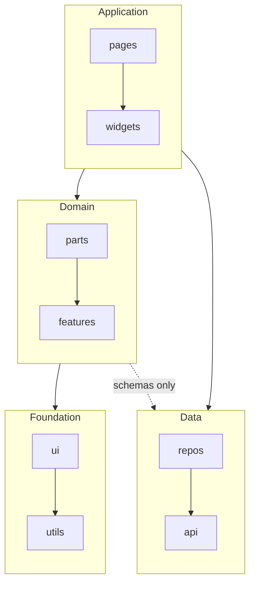

# Designing the Directory Structure for a New Frontend Project

Use this document when there is no codebase yet, or when a frontend foundation is still being designed and you need to prepare a structure proposal.

This assumes the project is not large enough to need a monorepo, and provides the minimum implementation directory structure for designing an ideal frontend architecture.

Application conditions:

- The user has not explicitly instructed a specific directory structure.
- You will propose the structure to the user and get approval before creating files, changing settings, or writing documentation.

This document is an onboarding guide for actually configuring a new project. Therefore, the directory structure below is not an example; it is the design to apply. Unless there are explicit user instructions or framework rules, do not reinterpret it with other structures or names.

In existing codebases, ignore this document completely unless the user explicitly instructs you to check it. Existing structure, team rules, and user instructions take precedence.

## Design Sequence

1. Decide whether to use a Query/Mutation pattern.
2. Decide whether to implement DTO Transformation responsibility.
3. Adjust directory names according to framework rules.
4. Propose the directory structure based on the selected options.
5. Explain dependencies between directories.
6. Ask the user whether to configure `eslint-plugin-boundaries`.
7. If approved, enforce the rules through ESLint configuration. If declined, ask again whether to record the rules in documentation and where.

## User Choice Options

### 1. Whether to Use a Query/Mutation Pattern

Ask whether the project will use a Query/Mutation pattern for server state or external data state management. Recommend Option A by default.

If Option A is chosen but it is not yet decided whether to use a library or implement it manually, suggest a suitable option such as TanStack Query based on the conversation so far.

#### Option A: Use the Pattern

Add a Repositories layer for managing Query/Mutation Options.

- Add the Repositories layer. Create `repos/` and `repos/queries/`.

#### Option B: Do Not Use the Pattern

Do not add a Repositories layer for managing Query/Mutation Options.

- Create no folders for this purpose.

### 2. Whether to Implement DTO Transformation Responsibility

DTO Transformation is used to isolate client code from the impact of API changes. Explain the tradeoff and recommend the option that fits the user’s project.

#### Option A: Implement the Responsibility

Implement DTO Mapper functions and transformation types/schemas. This increases stability but also increases duplicate code.

It is useful for apps where backend and frontend deployment timing is hard to control, such as apps that must go through app-store review. It can also be replaced by having the backend guarantee backward compatibility.

- Add the Repositories layer. Create `repos/` and `repos/schemas/`.

#### Option B: Do Not Implement the Responsibility

Do not implement DTO Mapper functions or transformation types/schemas.

Deployment stability is lower, but there is no duplicate code and the structure stays simple. This is useful for web services.

- Create no folders for this purpose.

## Directory Structure

The structure below is described for the case where both the Query/Mutation pattern and DTO Transformation are used. Depending on the selected options, `repos` is added or removed.

```txt
src/
  pages/
  widgets/
  parts/
  ui/

  features/
  utils/

  api/
    endpoints/
    schemas/
  repos/
    queries/
    schemas/
```

## Directory Roles

| Directory | Role | Abstract Layer | Description |
| --- | --- | --- | --- |
| `pages` | Screen-level UI orchestration | Application | Page/route-level components. They handle UI flow, data fetching, and orchestration. As the direct layer delivered to users, they may have every type of dependency. |
| `widgets` | Standalone feature UI orchestration | Application | Independently functioning components. They may directly depend on most external data and state such as APIs and stores. Direct dependency on URL state or routes is allowed but not recommended. Examples: `<NewArrivalsSection shopId={shopId} />`, `<AuthorizationDialog onComplete={onComplete} />`. |
| `parts` | Domain-aware UI presentation | Domain | The lowest-level components that express domain language as UI. They understand business requirements or context but do not depend on external services, so direct access to external data or state such as API calls, queries, routers, and stores is not allowed. Example: `<ProductCard name={product.name} />`. |
| `features` | Reusable business rules, similar to Clean Architecture Entities and Use Cases | Domain | Reusable business rules such as product policy, validation, calculations, and feature flags. They exclude API calls and external service access. Compose `features` from pure functions, modules, types, and constants. Examples: `canBuyProduct(product)`, `isBetaEnabled(user)`. |
| `ui` | Generic UI presentation | Foundation | Pure generic UI components similar to a design system. Examples: `<Button />`, `<Switch />`. |
| `utils` | Generic utility logic | Foundation | Generic utilities such as pure functions, browser built-in API extensions, and generic React custom hooks. |
| `api` | Data | Data | API Client. |
| `api/endpoints` | Data | Data | API endpoint functions and API request/response execution boundaries. |
| `api/schemas` | Data | Data | API Request/Response and DTO types. |
| `repos` | Data | Data | Frontend-controlled external data access layer. Query Client. May be omitted depending on the selected directory structure. |
| `repos/queries` | Data | Data | Query/Mutation Options. May be omitted depending on the selected directory structure. |
| `repos/schemas` | Data | Data | DTO mappers and transformation types/schemas. May be omitted depending on the selected directory structure. |

Notes:

- Think again before adding `widgets`. Most code is sufficiently handled by inlining it in `pages` or abstracting it into `parts` or `ui`. Do not add `widgets` merely to reduce the amount of code needed for reuse.
- `features` is the layer that best reveals real-world business requirements. It is closest to Clean Architecture Entities and Use Cases in this structure, but it must not directly participate in rendering or external service execution. Delegate rendering to `parts`, and compose `features` from pure functions, modules, types, and constants.
- Add framework-provided directories such as `assets` or `public` as needed.

## Dependency Relationships

Except for the Data layer, the default import direction is `pages -> widgets -> parts -> features -> ui -> utils`. Reverse imports are forbidden.



Rules:

- Except for the Data layer, the default import direction is `pages -> widgets -> parts -> features -> ui -> utils`.
- Depending on the selected directory structure, `repos/*` may not exist.
- When `pages` and `widgets` access files in the same layer, they are limited to internal private modules. For example, a product list page must not import a product detail page.
- `pages` and `widgets` may access all Data-layer code (`api/*`, `repos/*`).
- `parts` and `features` may access only Data-layer schema code (`api/schemas`, `repos/schemas`). They must not access API clients, endpoints, or Query/Mutation Options.
- When `features -> ui` is used, rendering JSX or importing components/hooks is forbidden. This dependency should mainly be used for types or data transformation.

## Application Principles

- This document is the default for cases where no codebase exists and the user has not proposed a structure, so do not reinterpret it with different structures or names. Exceptions apply only when the user gives explicit instructions, framework rules require it, or the actual project structure already exists. At this stage, do not pre-open exceptions based on possibilities.
- Changes based on framework rules are allowed. For example, with Next.js App Router, use `app/` instead of `pages/`.
- This document defines only the top-level boundaries for the initial structure. Defer decisions about each layer’s subfolder structure and barrel files until actual implementation. Do not propose extra folders or barrel files during initial setup.
- If the user instructs a specific directory structure, do not demand that this document’s structure be followed exactly. Instead, verify whether the instructed structure satisfies the intent of the `frontend-layered-architecture` skill: adding a domain abstraction layer, isolating external data contracts, and designing correct dependency direction between layers. If it does not, propose improvements.

## Placement Examples

| Code | Recommended Location |
| --- | --- |
| `<NewArrivalsSection shopId={shopId} />` | `widgets/` |
| `<ProductCard name={product.name} />` | `parts/` |
| `toProductCardPropsFromProductDetail(product)` | `parts/` |
| `canBuyProduct(product)` | `features/` |
| `getProductsAPI()` | `api/endpoints/` |
| `productsQueryOptions()` | `repos/queries/` |
| `formatCurrency(price)` | `utils/` |

## Recording or Automating Layer Relationships

After proposing the directory structure and dependency relationships, first ask the user whether to automate them with `eslint-plugin-boundaries`.

If the user approves ESLint automation:

- Do not just propose it verbally. Install and configure `eslint-plugin-boundaries` directly.
- First check which package manager the project uses.
- Then check whether the project uses ESLint flat config or legacy config.
- Check the latest documentation for actual configuration syntax when working. Use Context7 if available.
- Express the dependency relationships above as boundaries rules according to the selected options.
- Run lint after configuration to verify that the rules work.

If the user declines ESLint automation:

- Do not configure ESLint.

After the ESLint automation decision has been handled, ask whether to also record the layer relationships in documentation, and if so, which file to record them in.

If the user approves documentation:

- Record the selected directory structure and layer relationships in the README, architecture document, or another project document specified by the user.
- The document should record the directory structure, roles, and import directions.
- If ESLint automation was configured, mention that the rules are enforced by ESLint.
- If ESLint automation was declined, record the rules as project conventions rather than automated checks.

If the user declines documentation:

- Do not write documentation.

Automation goals:

- Define each top-level directory as a boundaries element type.
- Define directories with roles different from their parent directory, such as `api/endpoints`, `api/schemas`, `repos/queries`, and `repos/schemas`, as separate types.
- Omit directories that were not selected. For example, omit `repos/` if it was not selected.
- Put only the allowed import directions from the “Dependency Relationships” section into the rules.
- Do not implement “limited to internal modules of the same role” in configuration.
- Do not enforce each base layer’s subfolder structure or barrel-file usage through configuration.
