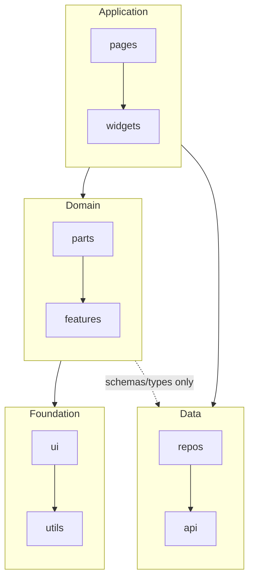

# Frontend Architecture Documentation Guide

Use this file to record the selected frontend directory structure and layer rules as a compact project convention summary for future contributors.

## Purpose

Write project rules only. Do not write an architecture tutorial, onboarding guide, design history, or copy of the skill content.

## Writing Rules

- Record only the selected final structure and the current rules the project will follow.
- Do not record rejected options, decision context, undecided items, placeholder sections, or placeholder wording.
- Prefer a one-screen document, roughly 50-120 lines. Ask before expanding beyond that.
- Do not include long per-directory descriptions, exhaustive import matrices, data-flow walkthroughs, framework basics, environment conventions, future adoption criteria, sanity checks, or tool setup details unless explicitly requested.
- Use the selected final directory names. Do not hardcode names from examples.
- In the directory structure block, add a short role comment to each selected directory.
- If directories have different Data access permissions, document them as separate compact rules; do not merge schema/type access and execution access into one dependency-rule bullet.
- When adding content to an existing document, adjust the location and headings to fit the existing document structure.

## Mermaid Rules

- Use Mermaid only as a simplified overview: abstract layers as subgraphs, selected top-level directories as nodes.
- Show limited cross-layer permissions with labeled dotted edges, such as `Source -. allowed scope only .-> Target`; record exact directory-level rules in text.
- Omit nested subdirectories and layer-internal details from Mermaid. Use `repos` and `api` as Data nodes, not `repos/queries` or `api/endpoints`.
- Record precise layer-internal import rules in text, not in Mermaid. For example, write `repos/queries -> repos/adapters` as a concrete project rule.

## Default Document Shape

Use this structure when the target document does not already have a better matching structure.

````md
## Layered Architecture

### Directory Structure

```txt
src/
  pages/     # Screen-level UI orchestration
  widgets/   # Standalone feature UI orchestration
  parts/     # Domain-aware UI presentation
  ui/        # Generic UI presentation

  features/  # Reusable business rules, similar to Clean Architecture entities/use-cases
  utils/     # Generic utility logic

  api/       # API client and endpoint functions
  repos/     # Data access adapter layer that limits the impact of external API changes
```

### Dependency Rules



- The default import direction outside the Data layer is `pages -> widgets -> parts -> features -> ui -> utils`. Reverse imports are forbidden.
- `pages` and `widgets` may use Data-layer execution code.
- `parts` and `features` may use only Data-layer schema/type code.
- Inside the Data layer, imports flow from `repos` to `api`.
````

Add code convention sections only for rules the user actually decided.

````md
## Code Conventions

### Naming Rules

- By default, file names match implementation names.

### File Placement

- Unit test files live next to the files they test.
````

The examples above show document shape only. Replace the directory names and rules with the selected final structure.

## ESLint Note

If `eslint-plugin-boundaries` is configured, record it with only one short sentence or bullet in the dependency rules. Do not include configuration or setup details in the project document.

## After Writing

After writing or updating the document, stop before the next workflow step and end with a direct adjustment question, such as:

```txt
Do any of the recorded rules need adjustment before we move on?
```
