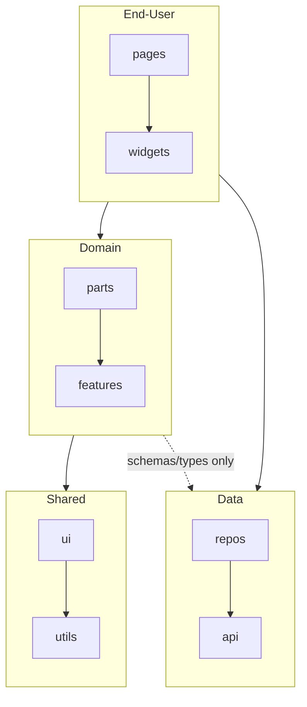

# Frontend Architecture Documentation Guide

Use this file to record selected frontend directory structure and layer rules as a compact project convention summary for future contributors.

Do not use this file to choose a new project structure, judge existing file placement, or configure lint/CI enforcement. Use `greenfield.md`, `brownfield.md`, or `enforcing-rules.md` for those purposes.

## Purpose

Write project rules only. Do not write an architecture tutorial, onboarding guide, design history, or copy of the skill content.

## Writing Rules

- Record only the selected final structure and the current rules the project will follow.
- Do not record rejected options, decision context, undecided items, placeholder sections, or placeholder wording.
- Prefer a one-screen document, roughly 50-120 lines. Ask before expanding beyond that.
- Do not include long per-directory descriptions, exhaustive import matrices, data-flow walkthroughs, framework basics, environment conventions, future adoption criteria, sanity checks, or tool setup details unless explicitly requested.
- Keep architecture documentation focused on directory structure and dependency rules. Add extra sections only when the user requests them or the target document already uses them.
- Use the selected final directory names. Do not hardcode names from examples.
- In the directory structure block, add a short role comment to each selected directory.
- If directories have different Data access permissions, document them as separate compact rules; do not merge schema/type access and execution access into one dependency-rule bullet.
- When adding content to an existing document, adjust the location and headings to fit the existing document structure.

## Mermaid Rules

- Use Mermaid as a simplified overview for human understanding, not as a complete dependency graph.
- Show the main relationships between layers first. When only selected directories in another layer are allowed, keep the edge between layers and name the allowed directories in the edge label, such as `EndUser -. collections & dto .-> Data`.
- Avoid drawing cross-layer edges directly between child directory nodes.
- Layer-internal arrows are optional. If you show them, use the same convention consistently across the diagram. Include them only when they stay simple, such as two nodes with a one-way dependency.
- Record only the dependency rules needed to disambiguate the diagram. If another source such as lint configuration is the detailed source of truth, mention it instead of repeating every rule.
- If Data has limited dependencies on other layers, describe the allowed direction or scope in dependency-rule bullets instead of drawing every relationship.

## Default Document Shape

Use this structure when the target document does not already have a better matching structure.

````md
## Layered Architecture

### Directory Structure

```txt
src/
  pages/     # Screen-level UI orchestration
  widgets/   # Standalone feature UI orchestration
  parts/     # Domain-aware UI presentation
  ui/        # General-purpose UI presentation

  features/  # Reusable business rules, similar to Clean Architecture entities/use-cases
  utils/     # General-purpose utility logic

  api/       # API client and endpoint functions
  repos/     # Data access adapter layer that limits the impact of external API changes
```

### Dependency Rules



- The default import direction is `End-User -> Domain -> Shared`; `Data` follows separate rules. Reverse imports are forbidden.
- `Data` is treated as external data contracts consumed by the frontend, even when the code is written inside the frontend codebase. `Data` may depend on other layers only in limited, project-approved ways.
- Import permission also depends on directory roles. For example, `features` is `Domain`, but it does not import `ui`.
- `pages` and `widgets` may use Data layer execution code.
- `parts` and `features` may use only Data layer schema/type code.
````

Add code convention sections only for rules the user actually decided.

````md
## Code Conventions

### Naming Rules

- By default, file names match implementation names.

### File Placement

- Unit test files live next to the files they test.
````

The examples above show document shape only. Replace the directory names and rules with the selected final structure.

## Enforcement Note

If architecture rules are enforced by ESLint, CI, or another tool, record only one short sentence or bullet in the dependency rules. Do not include configuration or setup details in the project document.

## After Writing

After writing or updating the document, stop before the next workflow step and end with a direct adjustment question, such as:

```txt
Do any of the recorded rules need adjustment before we move on?
```
